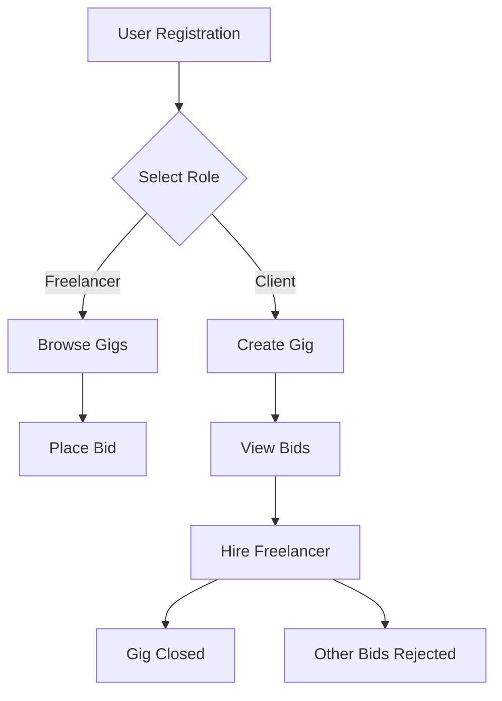

# GigFlow 🚀

> A Full-Stack Freelance Marketplace built with the MERN Stack

GigFlow is a comprehensive freelance marketplace where clients post gigs, freelancers place bids, and clients hire the best talent. This project emphasizes robust backend business logic, secure authentication, and correct state transitions over superficial UI elements.

**Built as part of a Full-Stack Development Internship Assignment**

---

## ✨ Features

### 🔐 Authentication & Authorization
- User signup & login with validation
- JWT authentication with HTTP-only cookies
- Persistent login sessions (refresh-safe)
- Role-based access control (Client / Freelancer)

### 📦 Gig Management
- Clients can create and manage gigs
- Public browsing of all open gigs
- Automatic hiding of assigned gigs from listings
- Status tracking throughout gig lifecycle

### 💼 Bidding System
- Freelancers can place one bid per gig
- Automatic bid blocking for assigned gigs
- Complete bid history stored in database
- Real-time bid validation and error handling

### 🧑‍💼 Hiring Logic (Core Feature)
- **Owner-only bid visibility** - Only gig creators can view bids
- **Single hire per gig** - Clients hire exactly one freelancer
- **Automated workflow on hiring:**
  - Selected bid → `hired`
  - All other bids → `rejected`
  - Gig status → `assigned`
  - New bids blocked automatically

### 🧠 Business Rules Enforced
- Owner-only bid viewing and hiring
- Single bid per user per gig constraint
- Proper gig lifecycle management (`open` → `assigned`)
- Comprehensive error handling (400, 401, 403, 404)

---

## 🛠 Tech Stack

### Frontend
- **React** (Vite) - Fast, modern development
- **Redux Toolkit** - State management
- **React Router** - Client-side routing
- **Tailwind CSS** - Utility-first styling
- **Axios** - HTTP client

### Backend
- **Node.js** - Runtime environment
- **Express.js** - Web framework
- **MongoDB** - NoSQL database
- **Mongoose** - ODM for MongoDB
- **JWT** - Secure token authentication
- **Cookie-based auth** - Enhanced security

### Development Tools
- **Postman** - API testing
- **MongoDB Compass** - Database visualization
- **Git & GitHub** - Version control

---

## 🗂 Database Schema

### User
```javascript
{
  name: String,
  email: String (unique),
  password: String (hashed),
  role: Enum ['owner', 'bidder']
}
```

### Gig
```javascript
{
  title: String,
  description: String,
  budget: Number,
  ownerId: ObjectId (ref: User),
  status: Enum ['open', 'assigned']
}
```

### Bid
```javascript
{
  gigId: ObjectId (ref: Gig),
  bidderId: ObjectId (ref: User),
  amount: Number,
  message: String,
  status: Enum ['pending', 'hired', 'rejected']
}
```

---

## 🔗 API Endpoints

### Authentication
| Method | Endpoint | Access | Description |
|--------|----------|--------|-------------|
| `POST` | `/api/auth/register` | Public | Register new user |
| `POST` | `/api/auth/login` | Public | Login user |
| `POST` | `/api/auth/logout` | Protected | Logout user |
| `GET` | `/api/auth/me` | Protected | Get current user |

### Gigs
| Method | Endpoint | Access | Description |
|--------|----------|--------|-------------|
| `POST` | `/api/gigs` | Protected | Create new gig |
| `GET` | `/api/gigs` | Public | Get all open gigs |

### Bids
| Method | Endpoint | Access | Description |
|--------|----------|--------|-------------|
| `POST` | `/api/bids` | Protected | Place a bid |
| `GET` | `/api/bids/:gigId` | Owner Only | View all bids for gig |
| `POST` | `/api/bids/hire` | Owner Only | Hire a bidder |

---

## 🔄 Application Flow


1. User registers as **Client** or **Freelancer**
2. Client creates a gig with budget and description
3. Freelancers browse open gigs and place bids
4. Client views all bids for their gig
5. Client hires one bidder (best fit)
6. System automatically:
   - Marks selected bid as `hired`
   - Rejects all other bids
   - Changes gig status to `assigned`
   - Blocks new bids

---

## 🧪 Testing

- ✅ **Backend APIs** tested using Postman collections
- ✅ **Database** verified using MongoDB Compass
- ✅ **Authentication** tested across multiple user roles
- ✅ **Authorization** boundary testing completed
- ✅ **Edge cases** handled:
  - Duplicate bid attempts
  - Unauthorized access attempts
  - Bidding on closed gigs
  - Invalid hire requests

---

## 🚀 Getting Started

### Prerequisites
- Node.js (v14 or higher)
- MongoDB (local or Atlas)
- npm or yarn

### 1️⃣ Clone the Repository
```bash
git clone https://github.com/your-username/gigflow.git
cd gigflow
```

### 2️⃣ Install Dependencies

**Backend:**
```bash
cd server
npm install
```

**Frontend:**
```bash
cd client
npm install
```

### 3️⃣ Environment Variables

Create `server/.env` file:
```env
PORT=5000
MONGO_URI=your_mongodb_connection_string
JWT_SECRET=your_jwt_secret
NODE_ENV=development
```

### 4️⃣ Run the Application

**Backend:**
```bash
cd server
npm run dev
```

**Frontend:**
```bash
cd client
npm run dev
```

The app will be available at:
- Frontend: `http://localhost:5173`
- Backend: `http://localhost:5000`

---

## 📌 Project Status

| Feature | Status |
|---------|--------|
| Core Requirements | ✅ Completed |
| Backend Logic | ✅ Completed |
| Authentication & Authorization | ✅ Completed |
| Bidding Workflow | ✅ Completed |
| Hiring System | ✅ Completed |
| Frontend UI | 🔄 In Progress |

> **Note:** Frontend bidding & hiring UI can be added incrementally. The backend fully supports all operations.

---

## 🧠 What This Project Demonstrates

- ✅ Real-world backend architecture design
- ✅ Secure authentication & authorization patterns
- ✅ Role-based access control implementation
- ✅ Complex database relationship modeling
- ✅ Clean REST API design principles
- ✅ Production-ready error handling
- ✅ Strong debugging & problem-solving skills
- ✅ Business logic implementation

---

## 🎯 Future Enhancements

- [ ] Payment integration (Stripe/PayPal)
- [ ] Real-time notifications (Socket.io)
- [ ] File upload for gig attachments
- [ ] Rating and review system
- [ ] Advanced search and filtering
- [ ] Admin dashboard
- [ ] Email notifications
- [ ] Dispute resolution system

---

## 📄 License

This project is for educational and evaluation purposes.

---

## 👤 Author

**Vaibhav**  
Full-Stack Developer | MERN Stack Enthusiast

*This project was created as part of a Full-Stack Development Internship Assignment*

---

## 🤝 Contributing

Contributions, issues, and feature requests are welcome!

---

## ⭐️ Show Your Support

If you found this project helpful, please give it a ⭐️!

---

<div align="center">
  
**Built with ❤️ using the MERN Stack**

</div>
